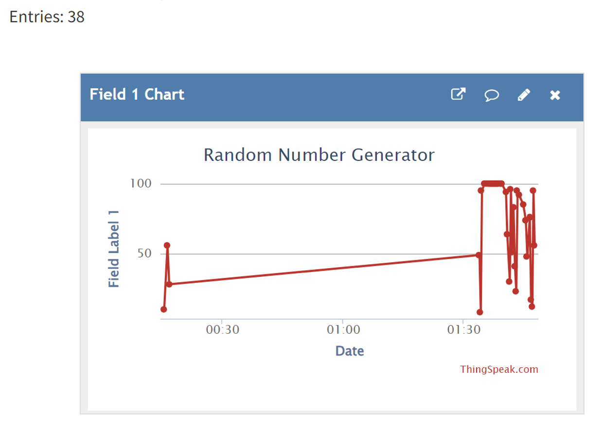
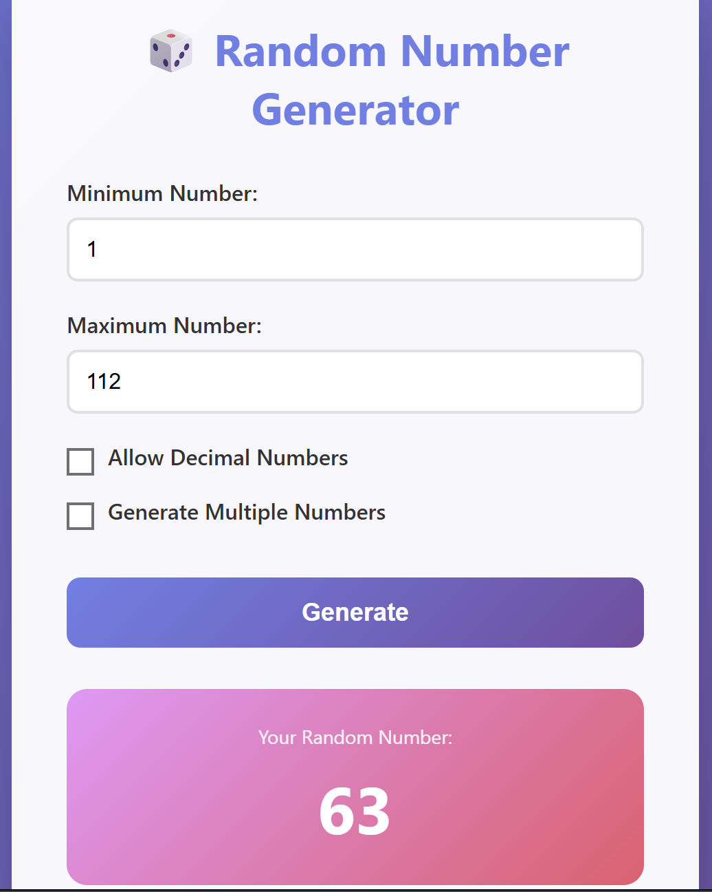
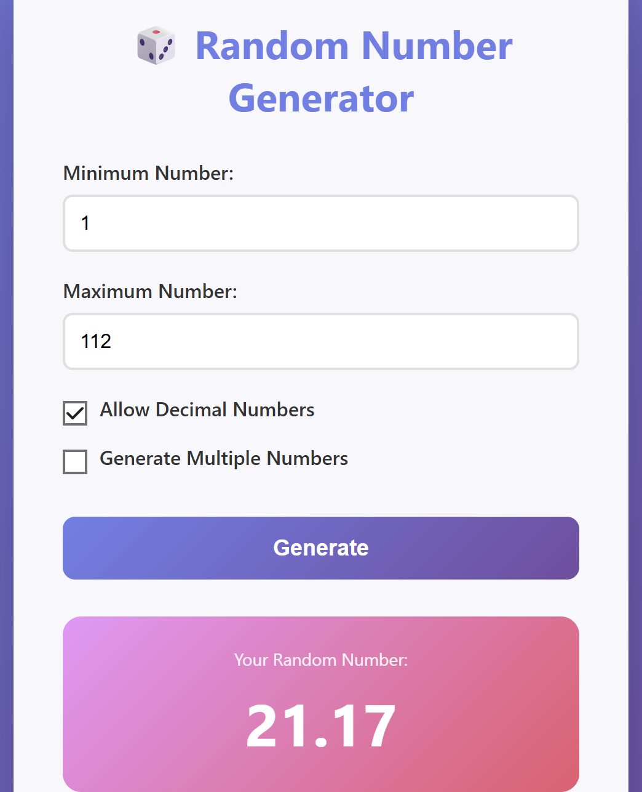
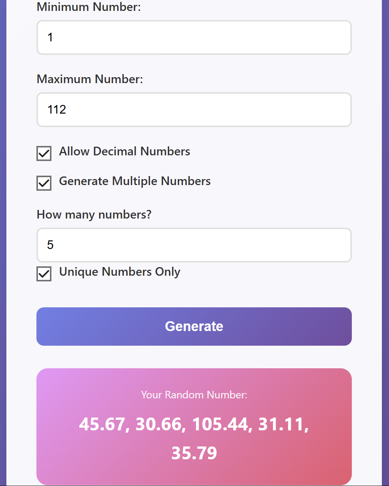

# 💡Random Number Generator - Two ways!

A comprehensive project demonstrating different approaches to random number generation, featuring both IoT-based hardware implementation using NodeMCU-32 (ESP32) and a web-based application.

## 🎯 Overview

This repository demonstrates two distinct approaches to generating random numbers, each with its own advantages and use cases:

- Hardware/IoT Approach - Using NodeMCU-32 (ESP32) microcontroller for embedded random number generation with cloud integration.

- Software/Web Approach - Browser-based application for instant random number generation.

### Method 1: IoT-Based Random Number Generator

**Platform: NodeMCU-32 (ESP32)**

**Language: C/C++ (Arduino)**

**Features:**

- Hardware-based random number generation with true RNG
- WiFi and Bluetooth connectivity
- Cloud integration (ThingSpeak)
- Real-time data logging and visualization
- Suitable for embedded systems and IoT applications

### Hardware Requirements
- NodeMCU-32 (ESP32 development board)
- USB cable (Micro-USB or USB-C depending on board version)
- Stable WiFi connection

### Software Requirements
- Arduino IDE (1.8.x or higher)
- ESP32 Board Package
- WiFi library (built-in with ESP32)
- ThingSpeak library (for cloud integration)

### Setup Instructions

1. **Install Arduino IDE and ESP32 Support:**
   ```
   - Open Arduino IDE
   - Go to File → Preferences
   - Add to "Additional Board Manager URLs":
     https://dl.espressif.com/dl/package_esp32_index.json
   - Go to Tools → Board → Boards Manager
   - Search for "esp32" and install "ESP32 by Espressif Systems"
   ```

2. **Configure WiFi Credentials:**
   ```cpp
   const char* ssid = "Your_WiFi_SSID";
   const char* password = "Your_WiFi_Password";
   ```

3. **Upload the Code:**
   - Connect NodeMCU-32 via USB
   - Select your board: Tools → Board → ESP32 Arduino → Your variant
   - Select the correct COM port
   - Set upload speed: 115200
   - Click Upload

 Refer to this [Link](https://www.espboards.dev/blog/setting-up-arduino-ide-esp32/) for guidance.

### ESP32 Advantages
- **True Hardware RNG:** ESP32 has a built-in hardware random number generator
- **Dual-Core:** Can handle WiFi and processing simultaneously
- **More Memory:** ESP 32's up to 520KB SRAM, up to 16MB flash vs ESP8266's 32KB instruction RAM, 80KB data RAM, up to 4MB flash
- **Bluetooth Support:** BLE and Classic Bluetooth
- **Better Performance:** 240MHz vs ESP8266's 80MHz
- **More GPIO pins:** ESP32 has more pins for connecting stuff like sensors and gadgets compared to ESP8266.

### Features
- Generates random numbers at specified intervals
- Transmits data via WiFi to cloud platforms
- Real-time monitoring through ThingSpeak or similar services
- Can be integrated into larger IoT projects
- Suitable for automated systems requiring random values

### Result

<p align="center">
  
</p>


### Method 2: Web Application

**Platform: Web Browser**

**Language: HTML, CSS, JavaScript**

**Features:**

- **Customizable Range:** Set any min/max values
- **Decimal Support:** Generate decimal or integer numbers
- **Multiple Numbers:** Generate up to 100 numbers at once
- **Unique Values:** Option to ensure no duplicates
- **User-Friendly:** Clean, modern interface
- **Input Validation:** Prevents invalid inputs
- **Responsive Design:** Works on desktop and mobile

### Requirements
- Any modern web browser (Chrome, Firefox, Safari, Edge)
- No installation needed

### How to Use

1. **Open the Application:**
   - Simply open `random_number_gen.html` in your browser
   - Or host it on any web server

2. **Set Your Parameters:**
   - Enter minimum value
   - Enter maximum value
   - Choose options:
     - Allow decimal numbers
     - Generate multiple numbers
     - Unique numbers only

3. **Generate:**
   - Click "Generate" button or press Enter
   - View your random number(s)


### Results

<p align="left">
  
 align="right">
  
</p>

<p align="center">
  
</p>

